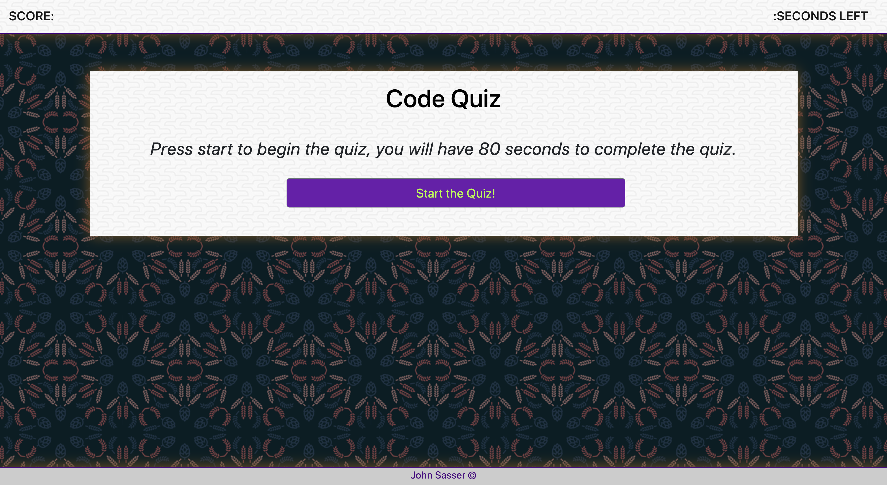

# 04-CodeQuiz

This is a javascript code knowledge quiz powered with html, css, javascript, jQuery & JSON

# .js built Code Quiz

This code quiz is built with HTML5, CSS3, Bootstrap, & Javascript using jQuery libraries and JSON storage and data transportation methods. It is a simple quiz with approximately 8 - 10 question about Javascript programing. Use as a brief warm-up before class or a quick refresher on how .js operates.

Format: 

## Getting Started

These instructions will get you a copy of the project up and running on your local machine for development and testing purposes.

- "Clone or download" locally to your machine.
- open your git bash or terminal and clone the repository locally on your computer.
- open and view from any code editor.

OR

- direct to the address [Live Bootstrap Portfolio](https://johnsasser.github.io/02-bsPortfolio/index.html)
  to view the portfolio on GitHub now.
  current projects and links under the portfolio tab.

## Prerequisites

What things you need to install the software and how to install them:

- Git Bash (for windows users)
- Terminal (for mac users)

## Built With:

- HTML5
- CSS3
- Bootstrap 4
- Javascript
- jQuery
- JSON

## contributing

- Please feel free to fork and pull anytime!

## Authors

[John B Sasser](https://github.com/JohnSasser) - Initial work

## License

This project is licensed under the MIT License - see the LICENSE.md file for details
